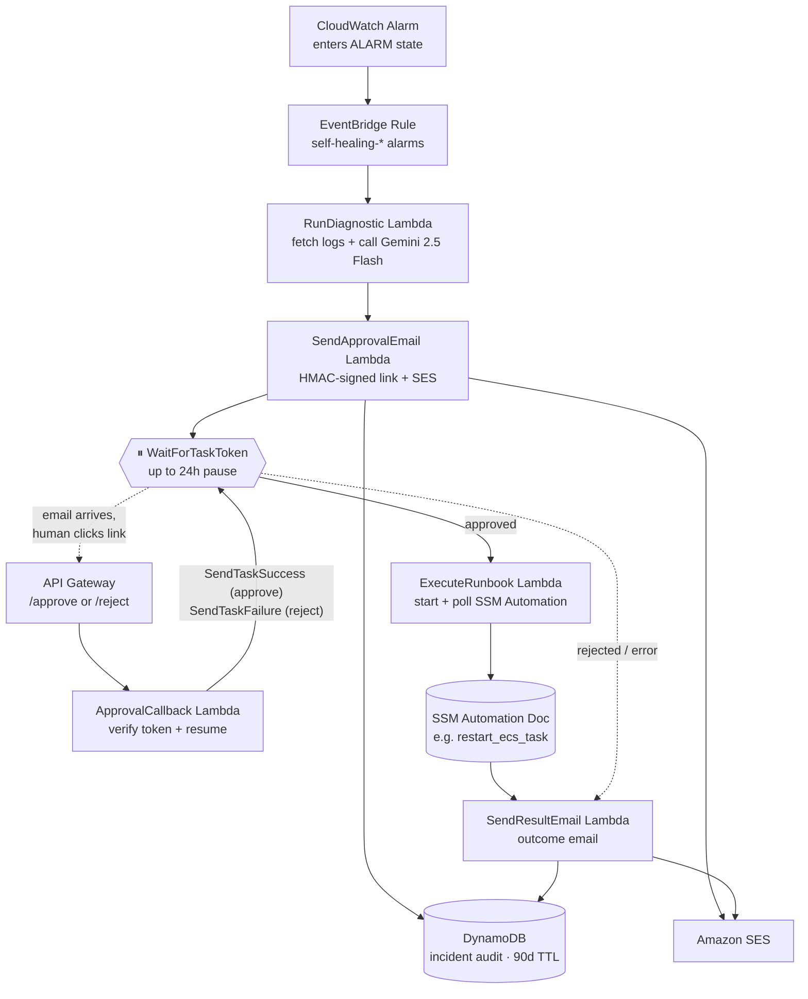

# Self-Healing Infrastructure with AI Runbooks

Automatically detects AWS infrastructure failures, uses **Gemini 2.5 Flash** to diagnose the issue from CloudWatch logs, sends a formatted approval email via SES, and — upon human approval — executes the fix using **SSM Automation**, all orchestrated by **AWS Step Functions** with a built-in Human-in-the-Loop pause.

> **HITL is a core design feature.** The system never executes a fix without an explicit human approval click. Every incident is stored in DynamoDB with a full audit trail from detection to resolution.

---

## Architecture



The entire workflow lives inside one Step Functions state machine. The HITL pause (`WaitForTaskToken`) is the design feature that keeps the system safe to put in front of real infrastructure.

---

## AWS Services Used

| Service | Purpose |
|---|---|
| CloudWatch Alarms + Logs | Detect failures, store logs |
| EventBridge | Route alarm state changes to Step Functions |
| Step Functions | Orchestrate workflow + HITL pause |
| Lambda (×5) | Diagnostic, SendApprovalEmail, ApprovalCallback, ExecuteRunbook, SendResultEmail |
| Gemini 2.5 Flash (Google AI Studio) | AI diagnosis from logs |
| Amazon SES | HTML approval + result emails |
| API Gateway | Approve/Reject callback endpoints |
| DynamoDB | Incident records + audit trail (90-day TTL) |
| SSM Automation | Execute remediation runbooks |
| Secrets Manager | Gemini API key |
| S3 + DynamoDB | Terraform remote state + locking |

---

## Prerequisites

- **AWS CLI v2** — `aws --version`
- **Terraform ≥ 1.7** — `terraform --version`
- **Python 3.11+** — `python --version`
- An **AWS account** with programmatic access (`aws configure` set up)
- A **verified SES email address** in your target region (both sender and recipient)
- A **Gemini 2.5 Flash API key** from [Google AI Studio](https://aistudio.google.com/app/apikey)

---

## Setup (first-time)

### Step 1 — Clone the repo

```bash
git clone https://github.com/Achinthya18/SelfHeal.git
cd SelfHeal
```

### Step 2 — Verify your SES sender email

```bash
aws ses verify-email-identity \
  --email-address YOUR_EMAIL \
  --region ap-south-1
```

Check your inbox and click the verification link before continuing.

### Step 3 — Create the Terraform remote state bucket

```bash
aws s3api create-bucket \
  --bucket self-healing-tf-state-YOUR_ACCOUNT_ID \
  --region ap-south-1 \
  --create-bucket-configuration LocationConstraint=ap-south-1

aws s3api put-bucket-versioning \
  --bucket self-healing-tf-state-YOUR_ACCOUNT_ID \
  --versioning-configuration Status=Enabled

aws s3api put-public-access-block \
  --bucket self-healing-tf-state-YOUR_ACCOUNT_ID \
  --public-access-block-configuration "BlockPublicAcls=true,IgnorePublicAcls=true,BlockPublicPolicy=true,RestrictPublicBuckets=true"
```

### Step 4 — Create the Terraform state lock table

```bash
aws dynamodb create-table \
  --table-name terraform-state-lock \
  --attribute-definitions AttributeName=LockID,AttributeType=S \
  --key-schema AttributeName=LockID,KeyType=HASH \
  --billing-mode PAY_PER_REQUEST \
  --region ap-south-1
```

### Step 5 — Update the backend config

Edit `terraform/main.tf` and replace the S3 bucket name in the `backend "s3"` block:

```hcl
backend "s3" {
  bucket         = "self-healing-tf-state-YOUR_ACCOUNT_ID"
  key            = "self-healing-infra/terraform.tfstate"
  region         = "ap-south-1"
  dynamodb_table = "terraform-state-lock"
  encrypt        = true
}
```

### Step 6 — Create your tfvars file

```bash
cp terraform/environments/dev/terraform.tfvars.example \
   terraform/environments/dev/terraform.tfvars   # create if needed
```

Fill in `terraform/environments/dev/terraform.tfvars`:

```hcl
aws_region                    = "ap-south-1"
environment                   = "dev"
ses_sender_email              = "YOUR_VERIFIED_EMAIL"
ses_recipient_email           = "YOUR_EMAIL"
gemini_model_id               = "gemini-2.5-flash"
approval_token_expiry_minutes = 15
```

### Step 7 — Set the approval token secret

Generate a random secret and export it before every `terraform apply`:

```bash
# Linux / macOS
export TF_VAR_approval_token_secret=$(openssl rand -hex 32)

# Windows PowerShell
$env:TF_VAR_approval_token_secret = -join ((65..90)+(97..122)+(48..57) | Get-Random -Count 32 | ForEach-Object {[char]$_})
```

### Step 8 — Initialise and apply Terraform

```bash
cd terraform
terraform init
terraform apply -var-file="environments/dev/terraform.tfvars"
```

This provisions all AWS resources. Takes ~2 minutes. Note the outputs:

```
api_gateway_url    = "https://XXXX.execute-api.ap-south-1.amazonaws.com/v1"
step_functions_arn = "arn:aws:states:ap-south-1:..."
```

### Step 9 — Store your Gemini API key

```bash
aws secretsmanager update-secret \
  --secret-id "self-healing/gemini-api-key" \
  --secret-string "YOUR_GEMINI_API_KEY" \
  --region ap-south-1
```

### Step 10 — Trigger a test alarm

```bash
aws cloudwatch set-alarm-state \
  --alarm-name "self-healing-manual-test" \
  --state-value ALARM \
  --state-reason "first end-to-end test" \
  --region ap-south-1
```

Check your email within ~30 seconds. Click **Approve** or **Reject** to complete the flow.

---

## Runbooks

| Runbook ID | Trigger | What it does |
|---|---|---|
| `restart_ecs_task` | ECS task health check failures | Stops the unhealthy task; ECS starts a replacement |
| `restart_ec2_instance` | EC2 status check failed | Stop + start (moves to a new host) |
| `scale_out_asg` | ASG CPU > 85% sustained | Increments desired capacity by 1 |
| `rotate_rds_password` | RDS auth errors in logs | Generates new password, updates Secrets Manager + RDS |
| `increase_ecs_memory` | OOM kills in container logs | Registers new task definition revision with more memory |

### Adding a new runbook

1. **Write the SSM document** — create `ssm-documents/your_runbook.yaml` following the schema of an existing document (use `python3.11` runtime for `aws:executeScript` steps)

2. **Register with Terraform** — add a resource in `terraform/modules/ssm_documents/main.tf`:
   ```hcl
   resource "aws_ssm_document" "your_runbook" {
     name            = "self-healing-your-runbook"
     document_type   = "Automation"
     document_format = "YAML"
     content         = file("${path.module}/../../../ssm-documents/your_runbook.yaml")
   }
   ```

3. **Add to the Gemini allowlist** — in `lambdas/diagnostic/handler.py`, add `"your_runbook"` to the `ALLOWED RUNBOOK LIST` in `_SYSTEM_PROMPT`

4. **Add parameter parsing** — in `lambdas/execute_runbook/handler.py`, add a branch in `_build_ssm_parameters()` that extracts the right parameters from the `resource_arn`

5. **Deploy** — `terraform apply -var-file="environments/dev/terraform.tfvars"`

---

## Testing without triggering real fixes

**Option 1 — Reject the email**
Trigger the alarm, wait for the approval email, then click **Reject**. Step Functions receives `SendTaskFailure`, no SSM execution runs, DynamoDB shows `status=rejected`.

**Option 2 — Let the token expire**
Trigger the alarm, wait 16+ minutes without clicking, then click Approve. You will see "⏱ This approval link has expired" and no changes are made (`status` stays `pending` in DynamoDB).

**Option 3 — Direct Lambda invocation**
Invoke DiagnosticLambda directly with a test payload without touching the full pipeline:
```bash
aws lambda invoke \
  --function-name "diagnostic-lambda-dev" \
  --cli-binary-format raw-in-base64-out \
  --payload '{"alarm_name":"test","alarm_arn":"arn:test","resource_arn":"arn:test","log_group_name":"","region":"ap-south-1"}' \
  --region ap-south-1 \
  output.json && cat output.json
```

---

## Troubleshooting & Gotchas

Real bugs that bit this project during development. If you hit one of these, you're not the first.

### `InvalidAutomationExecutionParametersException: Undefined execution inputs: [AutomationAssumeRole]`

The SSM Automation document doesn't declare `AutomationAssumeRole` as a parameter. **Fix:** every YAML in `ssm-documents/` must include both an `assumeRole:` field at the top level AND an `AutomationAssumeRole` String parameter in the `parameters:` block:

```yaml
schemaVersion: "0.3"
description: ...
assumeRole: "{{ AutomationAssumeRole }}"
parameters:
  AutomationAssumeRole:
    type: String
    description: IAM role ARN that SSM Automation assumes while executing this runbook.
  ClusterName:
    type: String
  ...
```

The Lambda then passes it inside `Parameters`:
```python
Parameters = {
    **runbook_params,
    "AutomationAssumeRole": [SSM_AUTOMATION_ROLE_ARN],
}
```

> Older code passed `AutomationAssumeRoleArn=...` as a top-level kwarg. **Don't do this** — your Lambda's botocore version may not recognise it, and you'll get `ParamValidationError: Unknown parameter`.

### `ParamValidationError: Unknown parameter in input: "Tags"` / `AccessDenied: ssm:AddTagsToResource`

The Lambda role doesn't have `ssm:AddTagsToResource`. **Fix:** either drop the `Tags=[...]` kwarg from `start_automation_execution()` (it's purely cosmetic) or add the permission to the Lambda's IAM policy. This repo opts to drop the tags — they were never load-bearing.

### `InvalidParameterException: ECS is not authorized to perform: sts:AssumeRole on AWSServiceRoleForECS`

The ECS service-linked role doesn't exist in the account yet. AWS normally creates it lazily on first ECS use, but in fresh accounts the very first `CreateService` call fails. **Fix:** just retry `terraform apply` — by the time you re-run, the role has been auto-created and the service will create successfully.

### "Fix Failed" with `ClusterNotFoundException` on the manual-test alarm

The `self-healing-manual-test` alarm has no ECS metric dimensions, so the EventBridge transformer produces an empty cluster/service in the `resource_arn`. The pipeline runs all the way through and SSM rejects the call because the cluster doesn't exist.

**This is expected** — the manual-test alarm only verifies the diagnose → email → approve → SSM-call path. To see a full green run, point an alarm at a real ECS service whose metric dimensions include `ClusterName` and `ServiceName`. The transformer extracts those and builds a real service ARN.

### Gemini API key shows `PLACEHOLDER_REPLACE_WITH_REAL_KEY`

The Terraform module creates the Secrets Manager secret with a placeholder. After your first `terraform apply` you **must** update it manually before the system works:

```bash
aws secretsmanager update-secret \
  --secret-id "self-healing/gemini-api-key" \
  --secret-string "YOUR_REAL_KEY" \
  --region ap-south-1
```

This is intentional — the real key never lives in Terraform state. The Lambda fetches and caches it at cold-start.

### Approval email never arrives

Three likely causes:
1. **SES sandbox** — by default SES can only send to verified addresses. Both the sender AND the recipient must be verified individually until you request production access.
2. **Wrong region** — SES identity is per-region. Verifying in `us-east-1` won't help if your stack is in `ap-south-1`.
3. **Step Functions failed before the email step** — check the execution in the Step Functions console; if `RunDiagnostic` failed (e.g. Gemini key invalid), no email is sent.

---

## Repository Structure

```
├── lambdas/
│   ├── diagnostic/          # Fetches CW logs + calls Gemini
│   ├── send_approval_email/ # Formats + sends HTML approval email
│   ├── approval_callback/   # Handles approve/reject link clicks
│   ├── execute_runbook/     # Starts + polls SSM Automation
│   └── send_result_email/   # Sends outcome email, closes incident
├── ssm-documents/           # SSM Automation YAML runbooks (×5)
├── terraform/
│   ├── main.tf              # Root module — wires all sub-modules
│   ├── variables.tf / outputs.tf
│   ├── modules/
│   │   ├── cloudwatch/      # Alarms + log groups
│   │   ├── eventbridge/     # Rule + target + IAM role
│   │   ├── step_functions/  # State machine (ASL via jsonencode)
│   │   ├── lambdas/         # All 5 functions + IAM roles
│   │   ├── dynamodb/        # Incidents table (90-day TTL)
│   │   ├── api_gateway/     # /approve + /reject REST API
│   │   └── ssm_documents/   # 5 aws_ssm_document resources
│   └── environments/dev/    # terraform.tfvars
└── tests/
    ├── test_diagnostic_lambda.py
    └── test_approval_callback.py
```

---

## Environment Variables (Lambda)

All secrets are stored in AWS Secrets Manager or passed as Lambda environment variables via Terraform. Nothing is hardcoded.

| Variable | Lambda | Description |
|---|---|---|
| `GEMINI_SECRET_ARN` | diagnostic | ARN of the Gemini API key in Secrets Manager |
| `GEMINI_MODEL_ID` | diagnostic | Model to use (default: `gemini-2.5-flash`) |
| `SES_SENDER_EMAIL` | send_approval_email, send_result_email | Verified SES sender |
| `SES_RECIPIENT_EMAIL` | send_approval_email, send_result_email | Who receives the emails |
| `API_GATEWAY_BASE_URL` | send_approval_email | Base URL for approve/reject links |
| `APPROVAL_TOKEN_SECRET` | send_approval_email, approval_callback | HMAC secret for link signing |
| `APPROVAL_TOKEN_EXPIRY_MINUTES` | send_approval_email | Link lifetime (default: 15) |
| `SSM_AUTOMATION_ROLE_ARN` | execute_runbook | IAM role passed to SSM for runbook execution |
| `DYNAMO_TABLE_NAME` | all | DynamoDB incidents table name |
